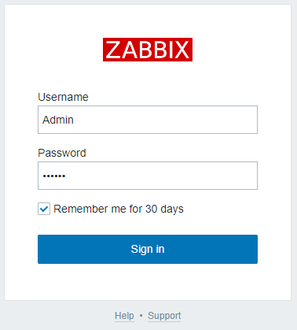
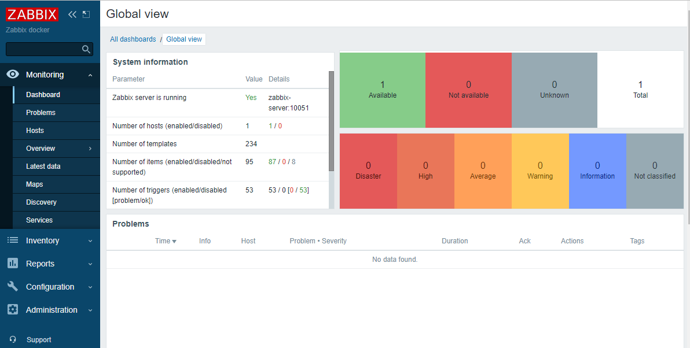
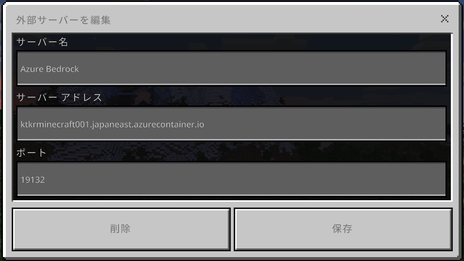
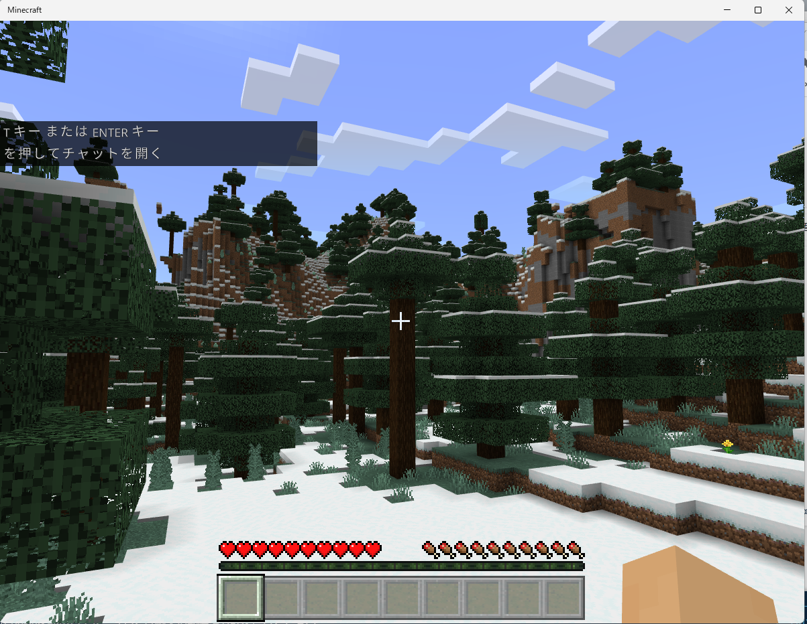

# azure-aci-docker-compose-sample

\(**This text is machine translated by DeepL**\)

## overview

This is a sample for container orchestration of an Azure Container Instance from a client PC using docker compose.

Azure Container Instance can be operated using the Azure CLI or deployed in YAML format.

However, this YAML format is also an extension of Azure's own (and thus allows for more native operations), so people who normally use docker compose may not be familiar with it.

Knowing that there are limitations, I tried the Azure extension of docker, whose features are documented below.

https://docs.docker.com/cloud/aci-integration/

## Required environment

A client PC capable of running Docker and Docker Compose

Do not actually run the docker container in the local environment

Preferably running Ubuntu or similar on Windows 10/11 with WSL (Docker Desktop should also be installed on the Windows host)

Of course, you also need to sign up for Azure Subscription

## sample codes

### Zabbix (Server, Web, Agent)

Use Azure database for MySQL flexible server for the persistent area, and deploy the container image available on DockerHub on Azure Container Instance using docker compose.

Modify the environment variable settings at the front of init.sh for your environment, and then execute the following command

```bash
az login
docker login azure
cd ./zabbix
./init.sh
docker --context zabbix compose up
```

The container will start normally.

```text
$ docker --context zabbix ps
CONTAINER ID        IMAGE                           COMMAND             STATUS              PORTS
aci-zabbix_server   zabbix/zabbix-server-mysql                          Running             ktkrzabbix001.japaneast.azurecontainer.io:10051->10051/tcp
aci-zabbix_agent    zabbix/zabbix-agent                                 Running             ktkrzabbix001.japaneast.azurecontainer.io:10050->10050/tcp  
aci-zabbix_web      zabbix/zabbix-web-nginx-mysql                       Running             ktkrzabbix001.japaneast.azurecontainer.io:8080->8080/tcp    
```

The first time you start the program, it will take some time to create the MySQL DB.

Connect to Zabbix Web using the following URL

```text
http://(DNS name).(Azure region).azurecontainer.io:8080
```

Default user id/password is Admin/zabbix



The status of Zabbix agent is also green.



### Minecraft (Bedrock server)

Use Azure file share for the persistent area, and deploy the container image published on DockerHub on Azure Container Instance using docker compose.

Modify the environment variable settings at the front of init.sh for your environment, and then execute the following command

```bash
az login
docker login azure
cd ./minecraft
./init.sh
docker --context minecraft compose up
```

The container will start normally.

```text
$ docker --context minecraft ps
CONTAINER ID             IMAGE                           COMMAND             STATUS              PORTS
aci-minecraft_beserver   itzg/minecraft-bedrock-server                       Running             ktkrminecraft001.japaneast.azurecontainer.io:19132->19132/udp
```

The first time you start the program, it will take some time to create the any files.

Check the logs with the docker logs command, and if you see the output "Server started", you are ready to go.

```text
$ docker --context minecraft logs aci-minecraft_beserver
[2022-01-28 07:51:19:170 INFO] Starting Server
[2022-01-28 07:51:19:170 INFO] Version 1.18.2.03
[2022-01-28 07:51:19:170 INFO] Session ID c01559f6-8fcf-4262-ac28-a79fff3886a9
[2022-01-28 07:51:19:190 INFO] Level Name: default
[2022-01-28 07:51:19:248 INFO] Game mode: 0 Survival
[2022-01-28 07:51:19:248 INFO] Difficulty: 2 NORMAL
[2022-01-28 07:51:28:235 INFO] opening worlds/default/db
[2022-01-28 07:52:30:334 INFO] IPv4 supported, port: 19132
[2022-01-28 07:52:30:334 INFO] IPv6 not supported
[2022-01-28 07:52:32:126 INFO] Server started.
[2022-01-28 07:52:32:349 INFO] IPv4 supported, port: 59996
[2022-01-28 07:52:32:349 INFO] IPv6 not supported
```

Connect and have fun with the Minecraft app on Windows, iOS, and Android!

Server name is (DNS name).(Azure region).azurecontainer.io

Server port is 19132



Once you're safely connected, play with it for a bit!



## Caution

This sample is for using Azure Container Instance from Docker compose.

Security is very weak when it comes to connecting to Azure Storage and Azure Database for MySQL.

The other reason was that Docker Compose alone could not be used to deploy in a Virtual Network or use Secret.

If you want to use Container Instance on Azure in earnest

- Directly reference the Managed ID and Key Vault from the program in the container image
- Deploy with Azure's own YAML to deploy Container Instance in Virtual Network

It is recommended to take the following measures
